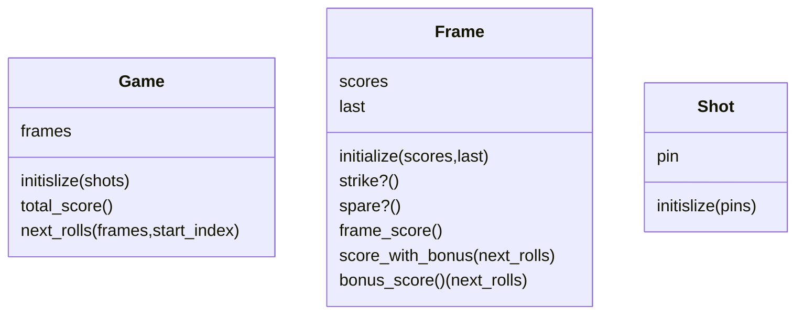

```mermaid
classDiagram
    class Game{
        frames
        initislize(shots)
        total_score()
        next_rolls(frames,start_index)
    }
    class Frame{
        scores
        last
        initialize(scores,last)
        strike?()
        spare?()
        frame_score()
        score_with_bonus(next_rolls)
        bonus_score()(next_rolls)
    }
    class Shot{
        pin
        initislize(pins)
    }

```